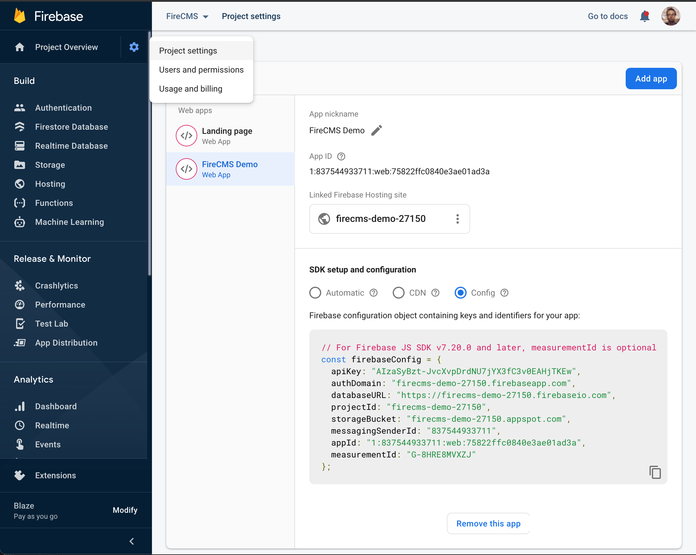

## Firebase setup

In order to run FireCMS, you need to create a Firebase project first, with
some requirements:
- You need to enable Firestore in it.
- In the project settings, you need to create a Web application within your
  project, from which you can get your Firebase config



Note that you can
## FireCMS setup

- Create a new React app including Typescript:

```
npx create-react-app my-cms --template typescript
```

- Go into the new directory:

```
cd my-cms
```

- Install FireCMS and it's peer dependencies:

```
yarn add @camberi/firecms firebase @material-ui/core @material-ui/icons @material-ui/pickers @material-ui/lab
```

You can replace the content of the file App.tsx with the following sample code.

Remember to **replace** the Firebase config with the one you get after creating a
webapp in the Firebase console.

```tsx
import React from "react";

import {
    Authenticator,
    buildCollection,
    buildProperty,
    buildSchema,
    CMSApp,
    NavigationBuilder,
    NavigationBuilderProps
} from "@camberi/firecms";

import firebase from "firebase/app";

import "typeface-rubik";
import "typeface-space-mono";

// TODO: Replace with your config
const firebaseConfig = {
    apiKey: "",
    authDomain: "",
    projectId: "",
    storageBucket: "",
    messagingSenderId: "",
    appId: ""
};

const locales = {
    "de-DE": "German",
    "en-US": "English (United States)",
    "es-ES": "Spanish (Spain)",
    "es-419": "Spanish (South America)"
};

const productSchema = buildSchema({
    name: "Product",
    properties: {
        name: {
            title: "Name",
            validation: { required: true },
            dataType: "string"
        },
        price: {
            title: "Price",
            validation: {
                required: true,
                requiredMessage: "You must set a price between 0 and 1000",
                min: 0,
                max: 1000
            },
            description: "Price with range validation",
            dataType: "number"
        },
        status: {
            title: "Status",
            validation: { required: true },
            dataType: "string",
            description: "Should this product be visible in the website",
            longDescription: "Example of a long description hidden under a tooltip. Lorem ipsum dolor sit amet, consectetur adipiscing elit. Proin quis bibendum turpis. Sed scelerisque ligula nec nisi pellentesque, eget viverra lorem facilisis. Praesent a lectus ac ipsum tincidunt posuere vitae non risus. In eu feugiat massa. Sed eu est non velit facilisis facilisis vitae eget ante. Nunc ut malesuada erat. Nullam sagittis bibendum porta. Maecenas vitae interdum sapien, ut aliquet risus. Donec aliquet, turpis finibus aliquet bibendum, tellus dui porttitor quam, quis pellentesque tellus libero non urna. Vestibulum maximus pharetra congue. Suspendisse aliquam congue quam, sed bibendum turpis. Aliquam eu enim ligula. Nam vel magna ut urna cursus sagittis. Suspendisse a nisi ac justo ornare tempor vel eu eros.",
            config: {
                enumValues: {
                    private: "Private",
                    public: "Public"
                }
            }
        },
        published: ({ values }) => buildProperty({
            title: "Published",
            dataType: "boolean",
            columnWidth: 100,
            disabled: (
                values.status === "public"
                    ? false
                    : {
                        clearOnDisabled: true,
                        disabledMessage: "Status must be public in order to enable this the published flag"
                    }
            )
        }),
        main_image: buildProperty({
            title: "Image",
            dataType: "string",
            config: {
                storageMeta: {
                    mediaType: "image",
                    storagePath: "images",
                    acceptedFiles: ["image/*"]
                }
            }
        }),
        tags: {
            title: "Tags",
            description: "Example of generic array",
            validation: { required: true },
            dataType: "array",
            of: {
                dataType: "string"
            }
        },
        description: {
            title: "Description",
            description: "Not mandatory but it'd be awesome if you filled this up",
            longDescription: "Example of a long description hidden under a tooltip. Lorem ipsum dolor sit amet, consectetur adipiscing elit. Proin quis bibendum turpis. Sed scelerisque ligula nec nisi pellentesque, eget viverra lorem facilisis. Praesent a lectus ac ipsum tincidunt posuere vitae non risus. In eu feugiat massa. Sed eu est non velit facilisis facilisis vitae eget ante. Nunc ut malesuada erat. Nullam sagittis bibendum porta. Maecenas vitae interdum sapien, ut aliquet risus. Donec aliquet, turpis finibus aliquet bibendum, tellus dui porttitor quam, quis pellentesque tellus libero non urna. Vestibulum maximus pharetra congue. Suspendisse aliquam congue quam, sed bibendum turpis. Aliquam eu enim ligula. Nam vel magna ut urna cursus sagittis. Suspendisse a nisi ac justo ornare tempor vel eu eros.",
            dataType: "string",
            columnWidth: 300
        },
        categories: {
            title: "Categories",
            validation: { required: true },
            dataType: "array",
            of: {
                dataType: "string",
                config: {
                    enumValues: {
                        electronics: "Electronics",
                        books: "Books",
                        furniture: "Furniture",
                        clothing: "Clothing",
                        food: "Food"
                    }
                }
            }
        },
        publisher: {
            title: "Publisher",
            description: "This is an example of a map property",
            dataType: "map",
            properties: {
                name: {
                    title: "Name",
                    dataType: "string"
                },
                external_id: {
                    title: "External id",
                    dataType: "string"
                }
            }
        },
        expires_on: {
            title: "Expires on",
            dataType: "timestamp"
        }
    }
});

const localeSchema = buildSchema({
    customId: locales,
    name: "Locale",
    properties: {
        title: {
            title: "Title",
            validation: { required: true },
            dataType: "string"
        },
        selectable: {
            title: "Selectable",
            description: "Is this locale selectable",
            dataType: "boolean"
        },
        video: {
            title: "Video",
            dataType: "string",
            validation: { required: false },
            config: {
                storageMeta: {
                    mediaType: "video",
                    storagePath: "videos",
                    acceptedFiles: ["video/*"]
                }
            }
        }
    }
});

export function App() {

    const navigation: NavigationBuilder = ({ user }: NavigationBuilderProps) => ({
        collections: [
            buildCollection({
                relativePath: "products",
                schema: productSchema,
                name: "Products",
                permissions: ({ user }) => ({
                    edit: true,
                    create: true,
                    delete: true
                }),
                subcollections: [
                    buildCollection({
                        name: "Locales",
                        relativePath: "locales",
                        schema: localeSchema
                    })
                ]
            })
        ]
    });

    const myAuthenticator: Authenticator = (user?: firebase.User) => {
        console.log("Allowing access to", user?.email);
        return true;
    };

    return <CMSApp
        name={"My Online Shop"}
        authentication={myAuthenticator}
        navigation={navigation}
        firebaseConfig={firebaseConfig}
    />;
}
```

Then simply run
```
yarn start
```

